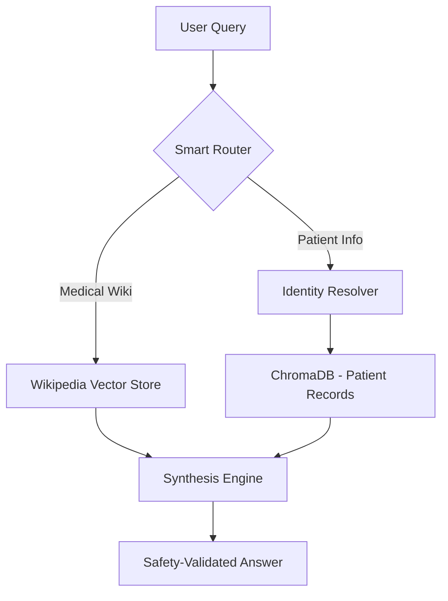

# 🏥 MediFlow: Clinical RAG & Identity Assistant

[](https://github.com/YOUR_USERNAME/med_interview/actions)


> **A production-inspired Medical RAG system** featuring cascading patient identity resolution, hybrid clinical safety checks, and GBNF-constrained routing.

---

## 🌟 Core Innovations

### 1. 🆔 Cascading Identity Resolution
Most RAG systems fail when users switch between "Ali Khan," "PT-102," or a phone number. MediFlow implements a **Greedy Resolution Cascade**:
- **Layer 1: Deterministic.** Checks System IDs (Regex) and GovIDs (Exact match).
- **Layer 2: Metadata Normalization.** Title-casing and alphanumeric stripping for name/phone matching.
- **Layer 3: Semantic/Fuzzy.** Vector-based similarity search for misspelled names or nicknames.

### 2. 🚦 Constraint-Guided Routing
Uses **GBNF (Geronimo's Backus-Naur Form) Grammars** to force Local LLMs (via Llama.cpp) to output strictly valid JSON, eliminating "hallucinated" formatting in the routing layer.

### 3. 🛡️ Clinical Safety Synthesis
The system cross-references **Patient History** (Private Vector Store) with **Medical Wiki Knowledge** (Public Vector Store) to detect contraindications (e.g., prescribing Propranolol to an Asthmatic patient).

---

## 🏗️ Architecture



---

## 🚀 Tech Stack

- **Orchestration:** LangChain / Python 3.12
- **LLMs:** Cerebras Cloud (Llama 3.1 70B) & Local Llama-3 (via GBNF Grammar)
- **Vector DB:** ChromaDB (Self-hosted)
- **Embeddings:** `google/embeddinggemma-300m` (Local Microservice)
- **Frontend:** Gradio (Admin & Assistant Interfaces)
- **API:** FastAPI

---

## 🔧 Getting Started

### 1. Clone & Environment
```bash
git clone https://github.com/voxMachina/mediflow.git
cd mediflow
pip install -r requirements.txt
cp .env.example .env # Add your CEREBRAS_API_KEY
```

### 2. Launch Services (Order Matters)
1. **Embedding Server:** `python apps/embedder.py` (Port 8001)
2. **Back-end API:** `python apps/api.py` (Port 8002)
3. **Data Ingestion:** `python scripts/ingest.py`
4. **User UI:** `python apps/assistant.py` (Port 7860)

---

## 🧪 Interview Highlights (What to look for)
- **`src/core/identity.py`**: Look at the `resolve_patient_identity` function to see how I handle ambiguous matches and clarify with the user.
- **`src/prompts/templates.py`**: Check the GBNF grammar used to ensure structured output from open-source models.
- **`main_api.py`**: Note the custom `/ingest_record` logic that prevents duplicate GovID registration.

---

## 📈 Future Roadmap
- [ ] Integration with FHIR/HL7 standards for hospital data.
- [ ] Multi-modal support (Reading X-Ray/Prescription images).
- [ ] Automated Unit Testing for Medical Safety Logic.

---
*Disclaimer: For demonstration purposes only. Not intended for actual clinical use.*
```
